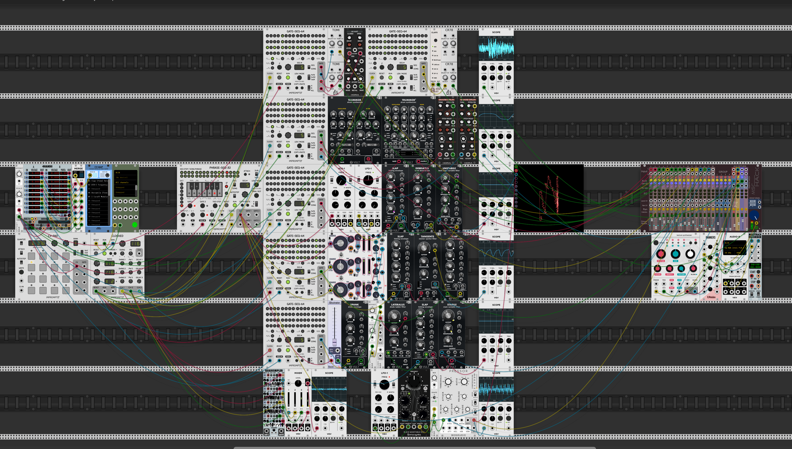

# Бесхребетное солнце VCV Rack

A virtual modular rack for song https://youtu.be/Y2RphGohREE

Instalation and running:
1. Install [VCV Rack](https://vcvrack.com/)
2. Install plugins:
   - Vult
   - Impromptu modular
   - Hora
   - SV Modular
   - Autodafe
   - wiqid
   - stoermelder
   - Bogaudio
   - dBiz
   - NYSTHI
   - Bacon
   - Erica
   - mscHack
   - Audible Instruments
   - RJModules
3. For Ableton Push 2 usage install [AbletonPush2VCV](https://github.com/ed9m/ed9m_vcv/)

This work is licensed under a [Creative Commons Attribution NonCommercial-ShareAlike 4.0 International
License][cc-by-nc-sa]. [![CC BY 4.0][cc-by-nc-sa-shield]][cc-by-nc-sa] [![CC BY 4.0][cc-by-nc-sa-image]][cc-by-nc-sa]

[cc-by-nc-sa]: http://creativecommons.org/licenses/by-nc-sa/4.0/
[cc-by-nc-sa-image]: https://i.creativecommons.org/l/by-nc-sa/4.0/88x31.png
[cc-by-nc-sa-shield]: https://img.shields.io/badge/License-CC%20BY%20NC%20SA%204.0-lightgrey.svg
